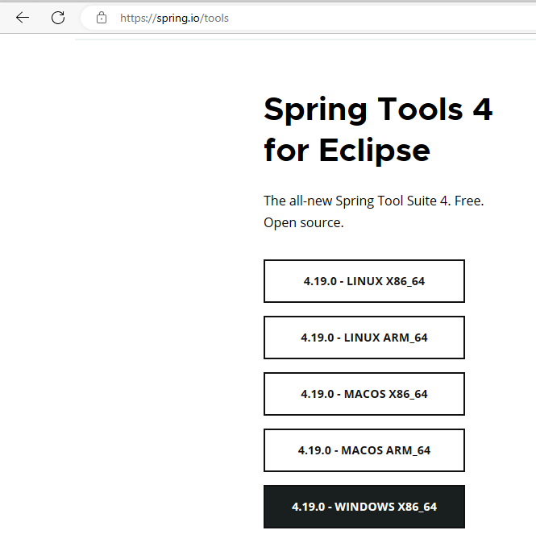
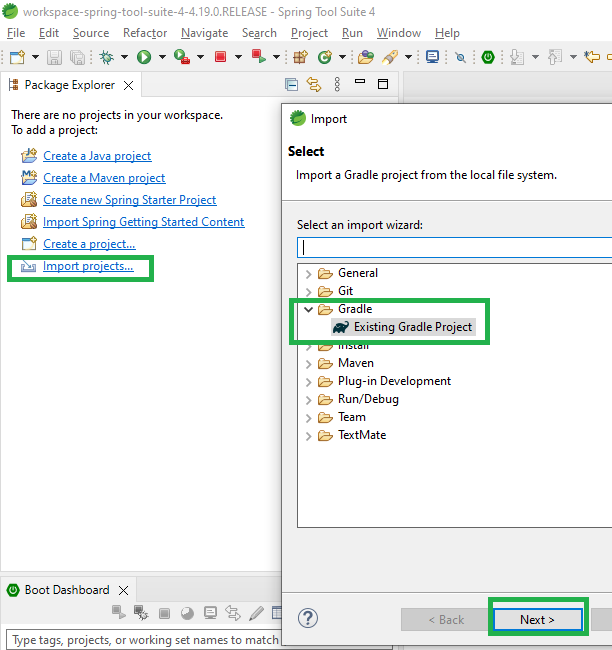
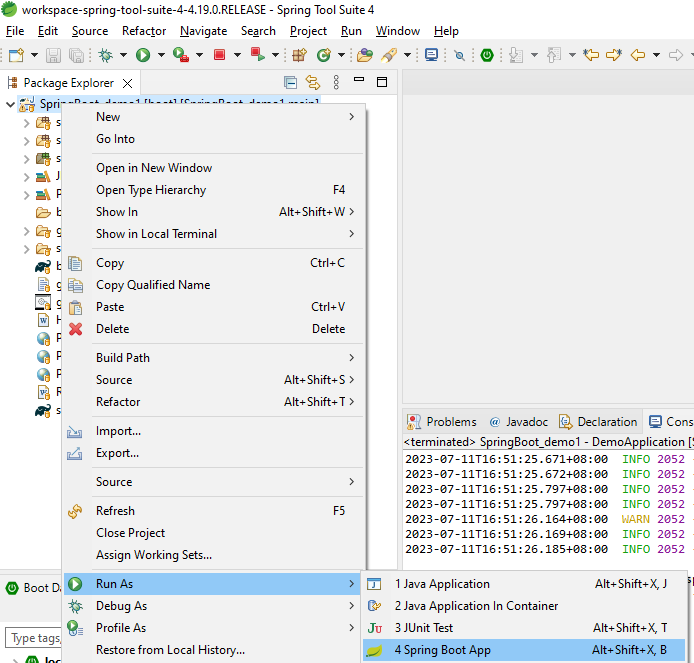
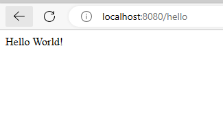

### Spring Boot Demo 1 Example

**Steps:**
<ol>
<li>Install IDE for Spring Project  
 <kbd></kbd>
<ul>
<li>Go to https://spring.io/tools - Download standalone jar (I downloaded Spring Tools 4 for Eclipse - Windows x86_64 )</li>
<li>Double click to run, and you will have generated folder 'sts-4.19.0.RELEASE' 
*Try to avoid downloading from https://www.eclipse.org/downloads/, cause you may need additional steps to install Spring extensions for Eclipse to detect Spring library imports.  
</li>
</ul>

</li>

 

<li>Run IDE  
<ul>
<li>$ cd sts-4.19.0.RELEASE</li>
<li>$ SpringToolSuite4.exe</li>
</ul>
</li>

 

<li>Git clone this project  
<ul>
<li>$ git clone https://github.com/worldpeacez0991/SpringBoot_demo1.git  
</li>
</ul>
</li>
 

<li>Once IDE is loaded;  
 
<kbd></kbd>
<ul>
<li>Select 'Import Projects...' >  </li>
<li>Select 'Existing Gradle Projects >   </li>
<li>Next  </li>
<li>Copy and paste directory for this Spring project  </li>
</ul>
</li>
 

<li>Once project is loaded, run the project as 'Spring Boot App'  </li>
<kbd></kbd>
 

 
<li>Open your browser and type 'http://localhost:8080/hello'</li>
<ul>
<li>If you see this text 'Hello World!', means your Spring project is success!  </li>
</ul>
<kbd></kbd>

</ol>

Credits: https://spring.io/team 
Source: https://spring.io/quickstart

